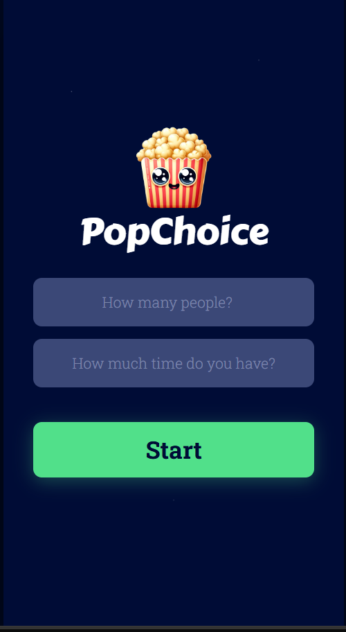
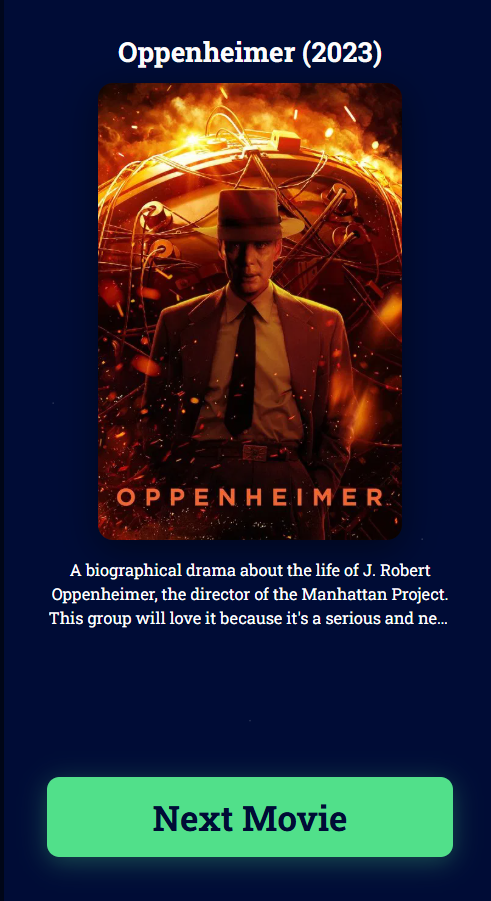

# 🍿 PopChoice

> AI-powered movie recommendation app for groups. Everyone answers a few questions about their taste, and PopChoice finds the perfect movie for the whole group.

---

## What It Does

PopChoice collects movie preferences from each person in the group individually, then uses AI and semantic search to recommend 3 movies that satisfy everyone. Each recommendation comes with a movie poster, description, and explanation of why the group will love it.

---

## Tech Stack

| Layer | Technology |
|---|---|
| Frontend | Vanilla HTML, CSS, JavaScript (Vite) |
| Chat AI | Groq (Llama 3.3 70B) |
| Embeddings | Google Gemini (`gemini-embedding-001`) |
| Vector Database | Supabase + pgvector |
| Movie Posters | TMDB API |
| Backend | Node.js + Express |

---

## How It Works

```
User answers questions (era, mood, favorite movie)
          ↓
Answers converted to a vector (Gemini Embeddings)
          ↓
pgvector finds similar movies in Supabase database
          ↓
Groq picks the 3 best matches from those results
          ↓
TMDB fetches the poster for each recommended movie
          ↓
Results displayed with poster, title, and description
```

This approach is called **RAG (Retrieval-Augmented Generation)** — instead of letting the AI guess from its training data, we first find relevant movies from our own database, then ask the AI to pick from those. The recommendations get smarter over time as more sessions are stored.

---

## App Flow

```
Start Screen
  → enter number of people + available time

Per-Person Screen (repeats for each person)
  → favorite movie (optional)
  → era: New / Classic / Either  (required)
  → mood: Fun / Serious / Inspiring / Scary  (required)
  → desert island film person (optional)

Loading Screen
  → AI pipeline runs in background

Result Screen
  → 3 movie recommendations
  → cycle through with Next Movie button
  → Go Again to start over
```

---

## Project Structure

```
popchoice/
├── index.html        # all 4 screens (start, person, loading, result)
├── index.css         # all styles
├── index.js          # app logic + screen flow + AI pipeline
├── config.js         # Groq client, Supabase client, Gemini embedding helper, TMDB
├── content.js        # movie knowledge base (used for seeding Supabase)
├── server.js         # Express backend (Gemini embedding endpoint)
├── movies.txt        # raw movie data source
├── package.json
└── .env              # API keys (never committed)
```

---

## Getting Started

### Prerequisites

- Node.js 18+
- A Supabase account
- API keys for: Groq, Google Gemini, TMDB

### 1. Clone the repo

```bash
git clone https://github.com/yourname/popchoice.git
cd popchoice
npm install
```

### 2. Set up environment variables

Create a `.env` file in the root:

```env
# Backend (used by server.js)
GEMINI_API_KEY=your_gemini_key

# Frontend (used by Vite — must start with VITE_)
VITE_GROQ_API_KEY=your_groq_key
VITE_SUPABASE_URL=https://your-project.supabase.co
VITE_SUPABASE_API_KEY=your_supabase_anon_key
VITE_TMDB_API_KEY=your_tmdb_key
VITE_BACKEND_URL=http://localhost:3000
```

### 3. Set up Supabase

Enable the pgvector extension in your Supabase dashboard under **Database → Extensions**, then run this SQL:

```sql
-- Enable vector extension
create extension if not exists vector;

-- Movies table (seed this with your content.js data)
create table movies (
  id bigserial primary key,
  title text,
  release_year text,
  content text,
  embedding vector(3072)
);

-- Sessions table (stores past recommendations)
create table sessions (
  id uuid default gen_random_uuid() primary key,
  num_people int,
  duration text,
  answers_json jsonb,
  recommended_movie text,
  embedding vector(3072),
  created_at timestamp default now()
);

-- Similarity search function
create or replace function match_movies(
  query_embedding vector(3072),
  match_count int default 5
)
returns table (title text, content text, similarity float)
language sql stable
as $$
  select
    title,
    content,
    1 - (embedding <=> query_embedding) as similarity
  from movies
  order by embedding <=> query_embedding
  limit match_count;
$$;
```

### 4. Seed the movies database

Run this once to embed all movies from `content.js` into Supabase:

```bash
node seed.js
```

### 5. Run the app

Open two terminals:

```bash
# Terminal 1 — Express backend (Gemini embeddings)
node server.js

# Terminal 2 — Vite frontend
npm run dev
```

Open [http://localhost:5173](http://localhost:5173)

---

## Screenshots

<div align="center">

| Start | Questions | Result |
|---|---|---|
|  |  |  |

</div>

---

## API Keys — Where to Get Them

| Key | Where |
|---|---|
| `GROQ_API_KEY` | [console.groq.com](https://console.groq.com) |
| `GEMINI_API_KEY` | [aistudio.google.com](https://aistudio.google.com) |
| `SUPABASE_URL` + `SUPABASE_API_KEY` | Supabase dashboard → Project Settings → API |
| `TMDB_API_KEY` | [themoviedb.org/settings/api](https://www.themoviedb.org/settings/api) |

---

## Why Each Service Needs a Backend or Not

| Service | Runs in browser? | Reason |
|---|---|---|
| Groq | ✅ Yes | CORS enabled, `dangerouslyAllowBrowser` flag |
| Supabase | ✅ Yes | Designed for browser use |
| TMDB | ✅ Yes | CORS enabled, read-only key, no billing risk |
| Gemini | ❌ No | Blocks browser requests (CORS), billing-sensitive key |

---

## License

MIT